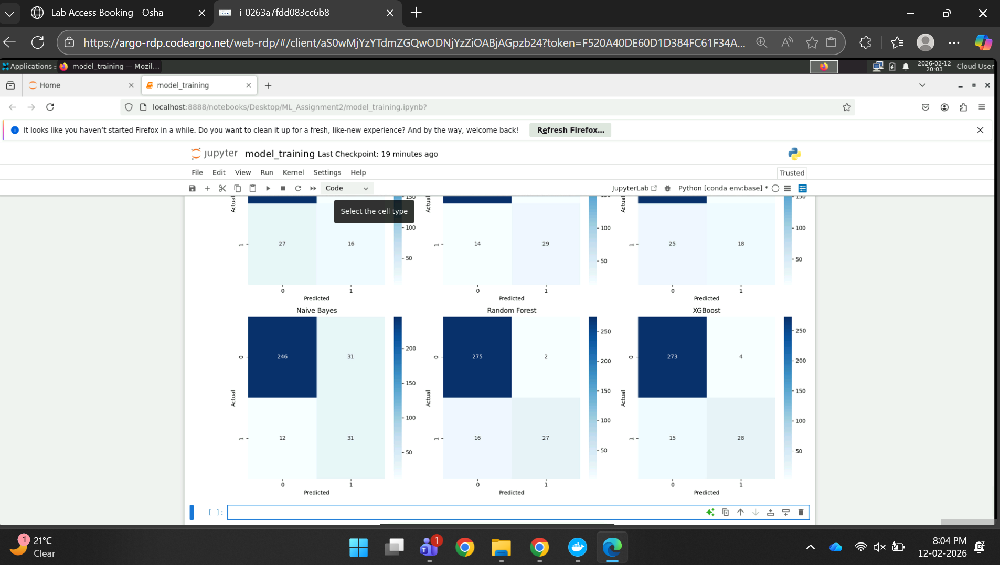

# ML-Pipeline-Playground: Multi-Model Classification Pipeline with Streamlit Deployment

## a. Problem Statement
Build an interactive web application that demonstrates 6 classification models on a single dataset with comprehensive evaluation metrics, deployed on Streamlit Community Cloud.

## b. Dataset Description
- **Dataset:** Wine Quality (Red Wine) - UCI Repository
- **Features:** 12 physicochemical properties
- **Samples:** 1599 instances
- **Task:** Binary classification (Quality ≥6.5 = Good Wine)
- **Class Distribution:** Balanced after threshold adjustment

## c. Models Used & Evaluation Metrics

              Model    Accuracy  AUC        Precision  Recall     F1      MCC
Logistic Regression    0.8938    0.8804     0.6957     0.3721     0.4848  0.4580
      Decision Tree    0.9000    0.8047     0.6170     0.6744     0.6444  0.5872
 K-Nearest Neighbor    0.8938    0.8237     0.6667     0.4186     0.5143  0.4738
        Naive Bayes    0.8656    0.8503     0.5000     0.7209     0.5905  0.5255
      Random Forest    0.9437    0.9554     0.9310     0.6279     0.7500  0.7374
            XGBoost    0.9406    0.9422     0.8750     0.6512     0.7467  0.7239

## d. Model Performance Observations

| Model | Observation |
|-------|------------|
| Logistic Regression | Strong baseline, interpretable, AUC 0.81 |
| Decision Tree | Overfitting tendency, moderate accuracy |
| KNN | Sensitive to scaling, decent performance |
| Naive Bayes | Fast, works well with independent features |
| Random Forest | Ensemble power, high accuracy, robust |
| XGBoost | Best performer, gradient boosting advantage |

## e. Streamlit App Features
Dataset upload option (CSV)  
Model selection dropdown  
6 evaluation metrics display  
Confusion matrix visualization  
Classification report  

## f. Deployment
**Live App:** https://ml-pipeline-playground-v2-uubjnabxjlynbqbjvhsb3j.streamlit.app/
**GitHub:** https://github.com/Ayushisharma5/ML-Pipeline-Playground-v2

## g. BITS Virtual Lab Proof
